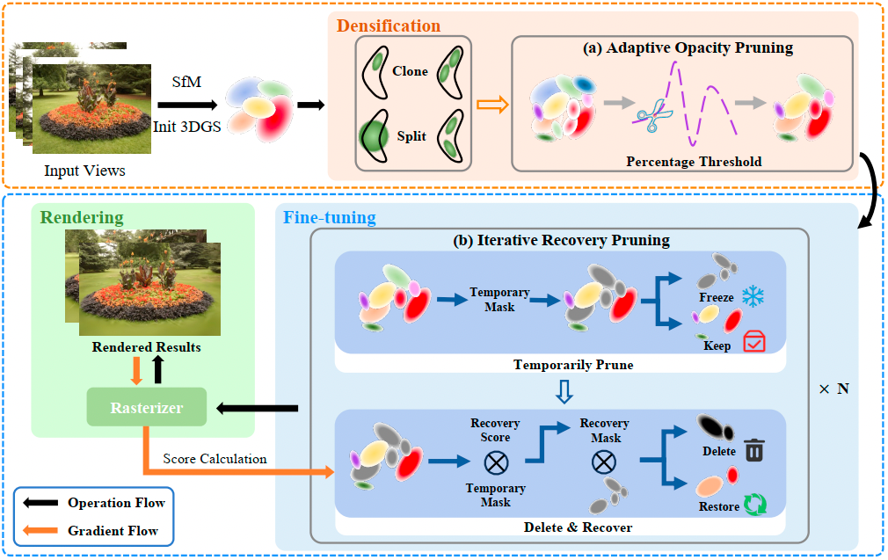

# ARGP : Adaptive and Recoverable 3D Gaussian Splatting Pruning for Efficient Real-Time Scene Reconstruction

This repository contains the official authors implementation associated with the paper "Adaptive and Recoverable 3D Gaussian Splatting Pruning for Efficient Real-Time Scene Reconstruction". 



Abstract: *3D Gaussian Splatting (3DGS) has emerged as an efficient explicit representation for real-time novel view synthesis. However, repeated densification during training often leads to uncontrolled Gaussian growth, causing heavy memory overhead and slow convergence. This redundancy stems from two limitations: (1) fixed opacity thresholds that fail to adapt to evolving distributions; (2) irreversible pruning strategies that risk eliminating essential Gaussians. 
To address this, we propose *Adaptive and Recoverable Gaussian Pruning (ARGP)*, a training-integrated framework that suppresses redundant growth while preserving reconstruction quality. During densification, we employ *Adaptive Opacity Pruning (AOP)*, which removes a fixed proportion of low-opacity Gaussians based on quantiles, effectively suppressing redundancy. In the fine-tuning stage, we introduce *Iterative Recovery Pruning (IRP)*, which selectively reinstates critical Gaussians using a gradient-informed recovery score, thus preventing over-pruning and preserving reconstruction quality. 
Extensive experiments on Mip-NeRF 360, Tanks & Temples, and Deep Blending validate the effectiveness our proposed ARGP. For instance, ARGP achieves an 85.4% reduction in Gaussian counts and 1.60× training speedup, while maintaining competitive reconstruction quality on Tanks & Temples.*
 

## Setup

Follow the setup instructions for the original [3D-GS](https://github.com/graphdeco-inria/gaussian-splatting/) codebase. Our code changes are made in (1) the differential renderer submodule and (2) the Python files in this repo.


## Cloning the Repository

The repository contains submodules, thus please check it out with 
```shell
# SSH
git clone git@github.com:Sinyo-Liu/ARGP.git --recursive
```
or
```shell
# HTTPS
git clone https://github.com/Sinyo-Liu/ARGP --recursive
```
